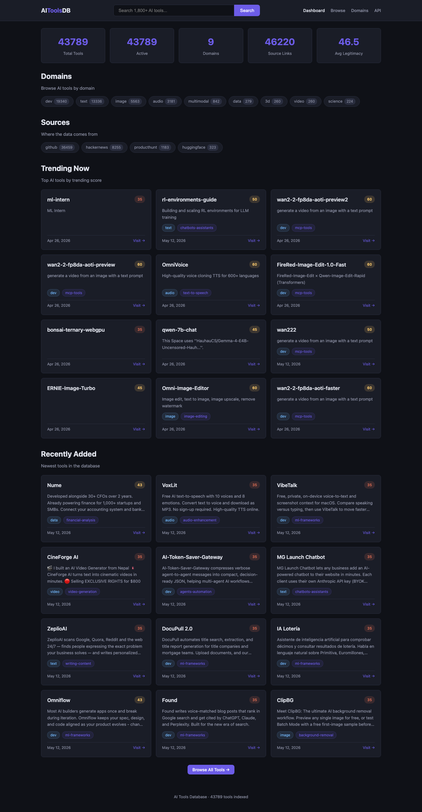
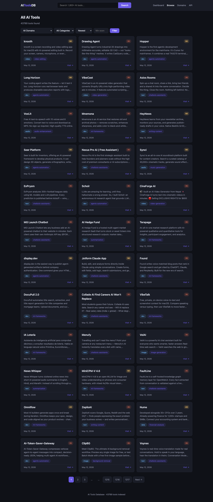
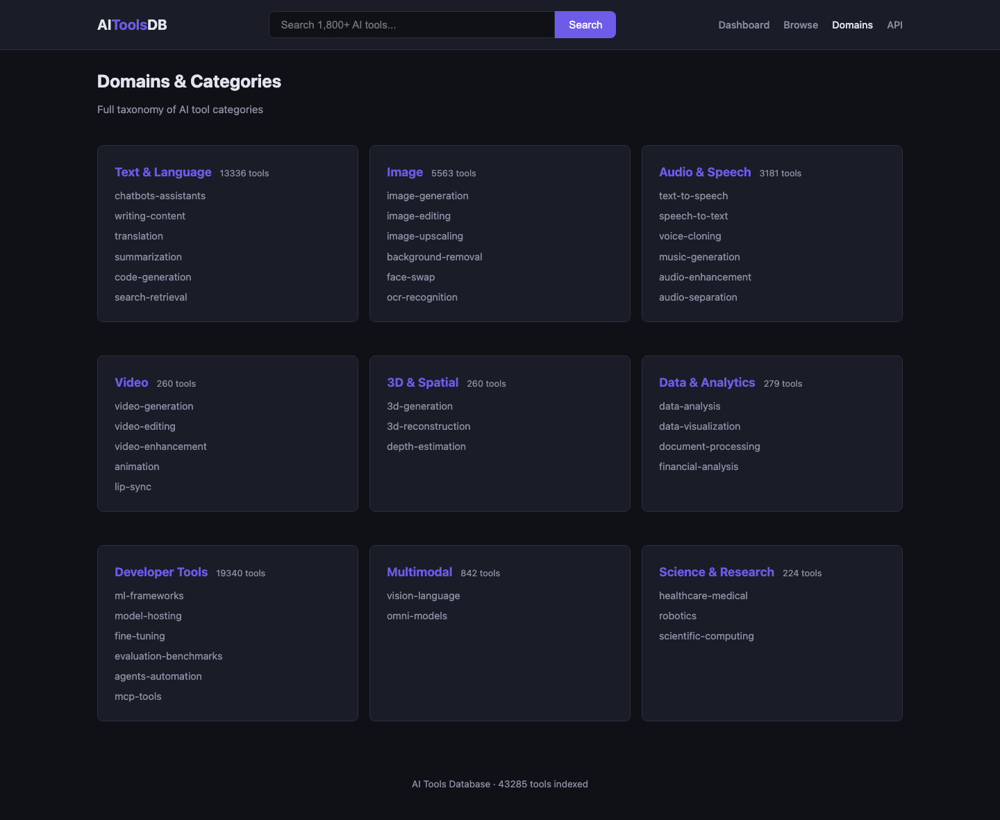
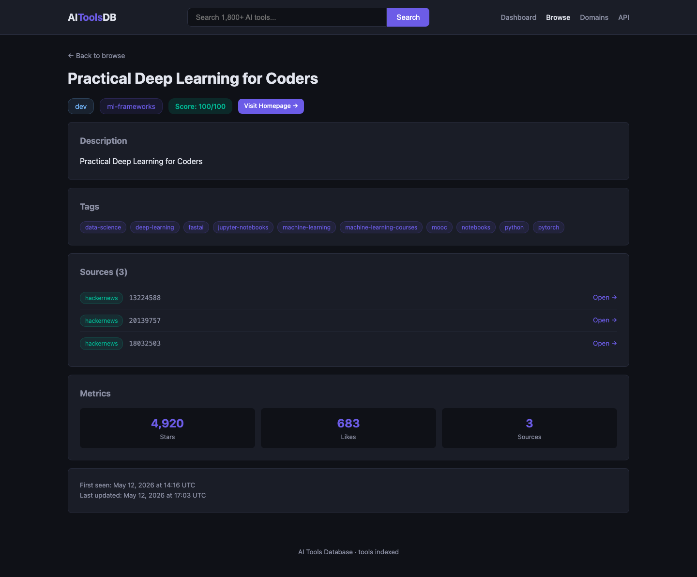

# AI Tools Database

Aggregated database of **43,000+ AI tools**, models, and services — inspired by [There's An AI For That](https://theresanaiforthat.com/). Collects data from multiple public APIs, classifies tools deterministically (no LLM hallucinations), and exposes both a web UI and REST API.

## Screenshots

### Dashboard


### Browse Tools


### Domains & Categories


### Tool Detail


## Architecture

```
Sources → Ingesters → PostgreSQL → Enrichment → FastAPI REST API
                                        ↑
                     Rule-based classifier (TAG_MAP + keyword regex)
```

### Data sources
| Source | What it fetches | Auth | Tools |
|--------|----------------|------|-------|
| HuggingFace | Trending Spaces | No | 323 |
| GitHub | Repos by AI topics | Token (free) | 36,459 |
| Product Hunt | AI-tagged launches | Bearer token (free) | 1,183 |
| Hacker News | Show HN + AI stories (Algolia) | No | 8,255 |

### Classification
All categorisation is **rule-based** — zero LLM involvement:
1. **TAG_MAP** (~200 entries): source tags → `(domain, category)` via voting
2. **Keyword regex** (~45 patterns): fallback on name + description
3. **Auto-reclassify**: enrichment pipeline re-classifies unclassified tools on every run
4. 98.8% classification rate across 43,000+ tools

LLM (gpt-4o-mini) is **only** used for optional pricing/summary extraction from homepages — never classification.

### Taxonomy (9 domains, ~35 categories)
`text`, `image`, `audio`, `video`, `3d`, `data`, `dev`, `multimodal`, `science`

## Quick start

### Prerequisites
- Python 3.12+
- PostgreSQL 14+

### Setup

```bash
# Clone & install
cd thereisanaiforthat
python -m venv .venv && source .venv/bin/activate
pip install -r requirements.txt

# Configure
cp .env.example .env
# Edit .env with your database URL and API keys

# Create tables (dev shortcut)
python manage.py init-db

# Run first ingestion
python manage.py ingest --source huggingface
python manage.py ingest              # all sources

# Score legitimacy & dedup
python manage.py enrich

# Start API server
python manage.py serve
```

### Docker

```bash
docker compose up -d        # PostgreSQL + app
docker compose exec app python manage.py init-db
docker compose exec app python manage.py ingest
```

## CLI commands

| Command | Description |
|---------|-------------|
| `python manage.py ingest [--source NAME] [--deep]` | Run ingestion (all or specific source) |
| `python manage.py enrich [--dedup] [--score] [--llm]` | Run enrichment pipeline |
| `python manage.py stats` | Show database statistics |
| `python manage.py export [OUTPUT] [--min-legitimacy N]` | Export to CSV |
| `python manage.py serve` | Start FastAPI server + scheduler |
| `python manage.py init-db` | Create tables (dev only) |

## API endpoints

| Method | Path | Description |
|--------|------|-------------|
| GET | `/api/tools` | List tools (paginated, filterable) |
| GET | `/api/tools/search?q=...` | Search by name/description |
| GET | `/api/tools/trending` | Top trending tools |
| GET | `/api/tools/{slug}` | Tool detail with tags, sources, metrics |
| GET | `/api/domains` | List all domains and categories |
| GET | `/api/stats` | Database statistics |
| POST | `/api/tools/submit` | Submit a tool manually |
| GET | `/health` | Health check |

### Query parameters for `/api/tools`
- `page`, `page_size` — pagination
- `domain`, `category`, `pricing_type` — filters
- `min_legitimacy` — minimum legitimacy score (0-100)
- `sort` — `newest` | `legitimacy` | `name`

## Legitimacy scoring (0-100)

Deterministic, rule-based scoring:
- Multi-source corroboration: up to 25 pts
- Homepage present: 10 pts
- Description quality: 10 pts
- Domain classified: 5 pts
- GitHub stars signal: up to 25 pts
- Likes/upvotes signal: up to 25 pts

## Project structure

```
├── manage.py                  # CLI entry point
├── app/
│   ├── main.py                # FastAPI app
│   ├── config.py              # Pydantic Settings
│   ├── database.py            # SQLAlchemy async engine
│   ├── scheduler.py           # APScheduler jobs
│   ├── models/
│   │   ├── tool.py            # Tool, ToolTag, ToolSource, ToolMetric
│   │   └── ingestion.py       # IngestionRun audit table
│   ├── taxonomy/
│   │   ├── domains.py         # 9 domains, ~35 categories
│   │   ├── tag_map.py         # TAG_MAP (150+ source tag mappings)
│   │   └── classifier.py      # classify_tool() — deterministic
│   ├── ingesters/
│   │   ├── base.py            # BaseIngester ABC + upsert logic
│   │   ├── huggingface.py     # Deep mode: 3 sort orders
│   │   ├── github.py          # Deep mode: 60 queries
│   │   ├── producthunt.py     # Deep mode: 6 AI topics
│   │   └── hackernews.py      # Deep mode: Algolia search API
│   ├── enrichment/
│   │   ├── dedup.py           # Cross-source URL dedup & merge
│   │   ├── reclassify.py      # Re-classify NULL-domain tools
│   │   ├── legitimacy.py      # Rule-based 0-100 scoring
│   │   └── llm_extract.py     # Optional pricing/summary extraction
│   └── api/
│       ├── schemas.py         # Pydantic response/request models
│       └── routes.py          # FastAPI route handlers
├── alembic/                   # Database migrations
├── docker-compose.yml
├── Dockerfile
└── requirements.txt
```

## Scheduler

When running via `manage.py serve`, the APScheduler runs:

| Job | Schedule | Sources |
|-----|----------|--------|
| Free-tier ingestion | Every 4 hours at :05 | HackerNews + HuggingFace |
| GitHub ingestion | Every 6 hours at :15 | GitHub |
| ProductHunt ingestion | Every 12 hours at :25 | ProductHunt |
| Enrichment | Twice daily (03:00, 15:00) | Dedup → Reclassify → Score |
